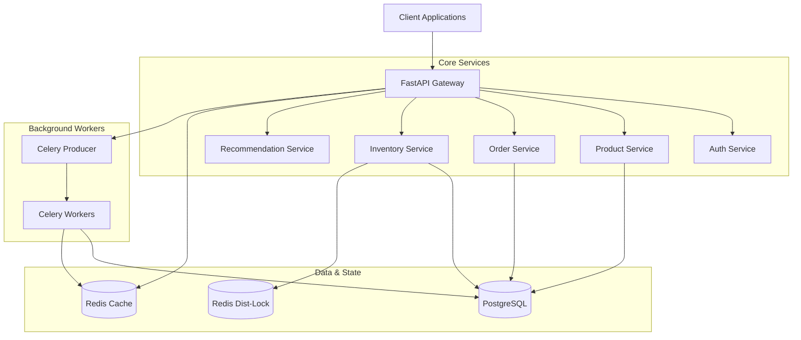

# Production-Grade E-Commerce Backend System

A high-performance, scalable backend system built with **FastAPI**, **PostgreSQL**, **Redis**, and **Celery**. This project demonstrates advanced backend engineering patterns, including distributed locking, asynchronous processing, and custom ranking algorithms.

##  Key Engineering Highlights

### **1. Advanced Concurrency Control**
To prevent overselling and race conditions during high-traffic events (e.g., flash sales), the system implements a **Dual-Layer Locking Strategy**:
- **Primary Lock (Database)**: Utilizing PostgreSQL's `SELECT ... FOR UPDATE` row-level locking to ensure ACID compliance during inventory updates.
- **Secondary Lock (Distributed)**: Using Redis `SETNX` (via `redlock` pattern) to handle distributed concurrency across multiple API instances before even hitting the database.
- **Optimistic Fallback**: An alternative reservation path using version columns for scenarios where pessimistic locking is too heavy.

### **2. Asynchronous Architecture**
Compute-intensive and I/O-heavy operations are offloaded to background workers using **Celery** with **Redis** as the broker:
- **Order Processing**: Email notifications and receipt generation.
- **Recommendation Engine**: Periodic re-calculation of the product co-occurrence matrix.
- **Inventory & Payment**: Async payment gateway integration with exponential backoff retries.

### **3. Algorithmic Intelligence**
The backend implements custom algorithms for product discovery rather than relying on simple database sorts:
- **Weighted Ranking**: A decay-based formula balancing popularity, rating, and recency.
- **Collaborative Filtering**: A "Frequently Bought Together" engine built on order history analysis.

---

##  System Architecture

The conceptual architecture follows a layered service pattern, ensuring separation of concerns and scalability.



---

##  Core Algorithms

### 1. Weighted Product Ranking
The `ProductService` implements a dynamic scoring algorithm to surface the most relevant products. The ranking score is computed via a SQL-injected formula during query time:

$$ Score = (0.5 \times Popularity_{norm}) + (0.3 \times Rating_{norm}) + (0.2 \times Recency_{decay}) $$

- **Popularity**: Normalized purchase count relative to the top-selling item (0-1).
- **Rating**: Average user rating normalized to a 0-1 scale.
- **Recency**: A time-decay function `max(0, 1 - (age / 30_days))` that boosts new products, ensuring the catalog feels fresh.

### 2. Recommendation Engine (Co-occurrence Matrix)
The recommendation system uses a memory-efficient implementation of Item-based Collaborative Filtering.
- **Training Phase (Celery Task)**:
  1. Iterates through completed orders in batches.
  2. Builds a co-occurrence matrix $M$ where $M_{ij}$ represents how many times Product $i$ and Product $j$ were bought together.
  3. Updates Redis sets `cooccurrence:{product_id}` with the top correlated products.
- **Inference Phase (API)**:
  1. **"Also Bought"**: Fetches the pre-calculated top $K$ neighbors from Redis for the current product.
  2. **"Recommended for You"**: Aggregates the co-occurrence vectors of the user's past purchases to find new, highly correlated products.

---

##  Security & Performance

### Security
- **Authentication**: JWT (JSON Web Tokens) with a short-lived access token and long-lived refresh token rotation.
- **Password Policies**: Argon2id hashing for password storage (resistant to GPU-based cracking).
- **Rate Limiting**: Redis-backed leaky bucket algorithm specifically tuning different limits for auth vs. read-only endpoints.

### Performance
- **Database Indexing**: Strategic B-tree and GIN indexes on `search_vector`, `category_id`, and `created_at`.
- **Cache-Aside Pattern**:
  - Hot data (product details, rankings) is cached in Redis with a TTL (Time-To-Live).
  - "Thundering Herd" protection via simplistic locking or expiry jitter.

---

##  Tech Stack

- **Language**: Python 3.11+
- **Framework**: FastAPI (Async support, Pydantic validation)
- **Database**: PostgreSQL 15+ (AsyncPG driver)
- **Cache/Queue**: Redis 7+
- **Task Queue**: Celery
- **Containerization**: Docker & Docker Compose
- **Testing**: Pytest, AsyncClient

---

##  Getting Started (Backend)

### Prerequisites
- Docker & Docker Compose
- **OR** Python 3.11+ & PostgreSQL locally installed

### Option 1: Docker (Recommended)
Spin up the entire infrastructure (API, DB, Redis, Worker, Beat) with one command:

```bash
docker-compose up --build
```

- **API Documentation**: Access at `http://localhost:8000/docs`
- **Database**: Port `5432`
- **Redis**: Port `6379`

### Option 2: Local Development

1. **Setup Virtual Environment**:
   ```bash
   cd backend
   python -m venv venv
   source venv/bin/activate  # Windows: venv\Scripts\activate
   pip install -r requirements.txt
   ```

2. **Configure Environment**:
   ```bash
   cp .env.example .env
   # Update DATABASE_URL and REDIS_URL in .env
   ```

3. **Run Migrations**:
   ```bash
   alembic upgrade head
   ```

4. **Start Services**:
   ```bash
   # Terminal 1: API Server
   uvicorn app.main:app --reload

   # Terminal 2: Celery Worker
   celery -A app.workers.celery_app worker --loglevel=info
   ```

##  Testing

The codebase includes comprehensive unit and integration tests.

```bash
cd backend
pytest -v
```
